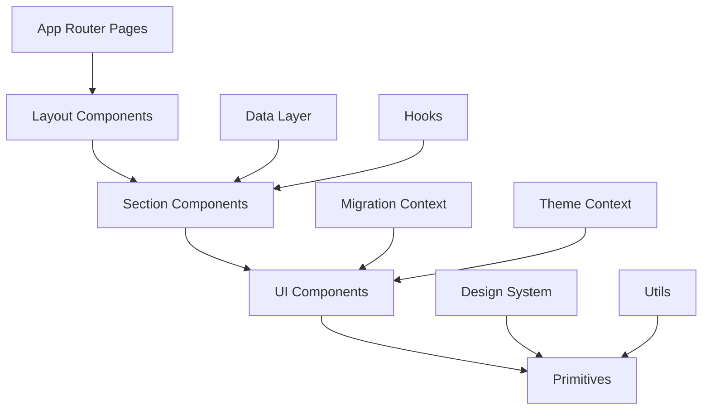
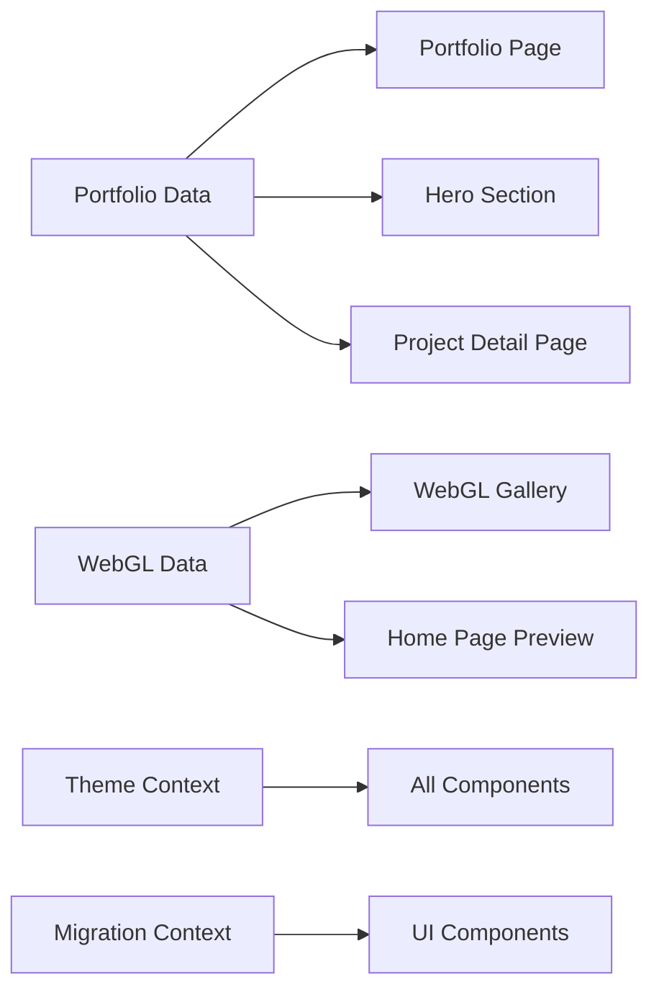

# Uable Corporation 프론트엔드 아키텍처 상세 분석

## 📋 목차
1. [프로젝트 개요](#프로젝트-개요)
2. [아키텍처 구조](#아키텍처-구조)
3. [기술 스택 & 의존성](#기술-스택--의존성)
4. [컴포넌트 시스템](#컴포넌트-시스템)
5. [UI 관리 전략](#ui-관리-전략)
6. [CSS 아키텍처](#css-아키텍처)
7. [상태 관리](#상태-관리)
8. [데이터 흐름](#데이터-흐름)
9. [라우팅 시스템](#라우팅-시스템)
10. [성능 최적화](#성능-최적화)
11. [개발 도구 & 스크립트](#개발-도구--스크립트)

---

## 🚀 프로젝트 개요

**Uable Corporation**은 3D/AR/WebXR 기술 전문 기업의 기업 웹사이트로, **Next.js 14 App Router**를 기반으로 구축된 현대적인 React 애플리케이션입니다.

### 핵심 특징
- **엔터프라이즈급 안정성**: Zero-Risk 마이그레이션 전략
- **점진적 UI 개선**: 무중단 컴포넌트 교체 시스템
- **완전한 타입 안전성**: End-to-end TypeScript 적용
- **접근성 우선**: WCAG 2.1 AA 준수
- **성능 최적화**: 빌드 크기 및 런타임 최적화

---

## 🏗️ 아키텍처 구조

### 디렉토리 구조

```
temp-project/src/
├── app/                          # Next.js 14 App Router
│   ├── layout.tsx               # 루트 레이아웃 + SEO 메타데이터
│   ├── page.tsx                 # 홈페이지
│   ├── portfolio/               # 포트폴리오 라우팅
│   │   ├── page.tsx            # 포트폴리오 목록
│   │   └── [id]/page.tsx       # 동적 라우팅 (프로젝트 상세)
│   ├── webgl/page.tsx          # WebGL 갤러리 전용 페이지
│   ├── contact/page.tsx        # 연락처 페이지
│   ├── privacy/page.tsx        # 개인정보처리방침
│   └── test/page.tsx           # 개발 테스트 페이지
│
├── components/                   # 컴포넌트 시스템
│   ├── ui/                     # Legacy UI 컴포넌트 (어댑터 포함)
│   │   ├── button.tsx          # Button 어댑터 (레거시 → 신규 전환)
│   │   ├── button-adapter.tsx  # 명시적 어댑터 구현
│   │   ├── badge.tsx          
│   │   ├── card.tsx
│   │   └── ...
│   ├── primitives/             # 새로운 디자인 시스템 컴포넌트
│   │   ├── Button/
│   │   │   ├── Button.tsx      # CVA + Radix 기반 현대적 구현
│   │   │   └── index.ts        # 명시적 export
│   │   ├── Badge/
│   │   ├── Card/
│   │   └── ...
│   ├── layout/                 # 레이아웃 컴포넌트
│   │   ├── header.tsx          # 헤더 (네비게이션 + 테마 토글)
│   │   └── footer.tsx          # 푸터
│   ├── sections/               # 페이지 섹션 컴포넌트
│   │   ├── hero-section.tsx    # 히어로 섹션
│   │   ├── problem-section.tsx # 문제 정의 섹션
│   │   ├── solution-section.tsx # 솔루션 섹션
│   │   └── ...
│   ├── portfolio/              # 포트폴리오 전용 컴포넌트
│   ├── webgl/                  # WebGL 갤러리 컴포넌트
│   └── seo/                    # SEO 최적화 컴포넌트
│
├── contexts/                     # React Context API
│   ├── ThemeContext.tsx        # 다크/라이트 모드 관리
│   └── MigrationContext.tsx    # UI 마이그레이션 상태 관리
│
├── data/                        # 정적 데이터
│   ├── portfolio.ts            # 포트폴리오 프로젝트 데이터
│   └── webgl-gallery.ts        # WebGL 번들 데이터
│
├── design-system/               # 디자인 시스템
│   └── utils/
│       └── index.ts            # 디자인 시스템 유틸리티
│
├── hooks/                       # 커스텀 훅
│   ├── use-scroll-animation.ts # 스크롤 애니메이션 훅
│   └── useConditionalTheme.ts  # 조건부 테마 훅
│
├── lib/                         # 유틸리티 라이브러리
│   ├── utils.ts                # clsx + tailwind-merge 통합
│   ├── validation.ts           # Zod 스키마 정의
│   ├── theme-performance.ts    # 테마 성능 최적화
│   ├── theme-class-mapping.ts  # 테마별 클래스 매핑
│   └── ...
│
├── styles/                      # 스타일 정의
│   ├── globals.css             # 전역 CSS + Tailwind base
│   └── design-tokens.ts        # 디자인 토큰 시스템
│
└── types/                       # TypeScript 타입 정의
    ├── portfolio.ts            # 포트폴리오 관련 타입
    └── inquiry.ts              # 문의 폼 타입
```

### 아키텍처 계층



---

## 🛠️ 기술 스택 & 의존성

### 핵심 프레임워크
```json
{
  "react": "^18.3.1",           // React 18 (Concurrent Features)
  "next": "^14.2.13",           // Next.js 14 App Router
  "typescript": "^5"            // TypeScript 5.x
}
```

### UI 라이브러리 & 디자인 시스템
```json
{
  "@radix-ui/react-*": "^1.x",           // 접근성 우선 Headless UI
  "class-variance-authority": "^0.7.1",   // 컴포넌트 variant 관리
  "tailwind-merge": "^3.3.1",            // Tailwind 클래스 동적 병합
  "clsx": "^2.1.1",                      // 조건부 className 유틸리티
  "lucide-react": "^0.536.0"             // 아이콘 시스템
}
```

### 폼 & 검증
```json
{
  "react-hook-form": "^7.62.0",          // 성능 최적화된 폼 라이브러리
  "@hookform/resolvers": "^5.2.1",       // RHF + Zod 통합
  "zod": "^4.0.14"                       // 스키마 기반 런타임 검증
}
```

### 애니메이션 & 인터랙션
```json
{
  "framer-motion": "^12.23.12"           // 고성능 애니메이션 라이브러리
}
```

### SEO & 성능
```json
{
  "next-sitemap": "^4.2.3"               // 자동 사이트맵 생성
}
```

### 개발 도구
```json
{
  "@types/*": "latest",                  // TypeScript 타입 정의
  "eslint": "^8.57.0",                   // 린팅
  "tailwindcss": "^3.4.1",               // 유틸리티 CSS 프레임워크
  "autoprefixer": "^10.4.19",            // CSS 벤더 프리픽스 자동 추가
  "postcss": "^8.4.35"                   // CSS 후처리
}
```

---

## 🧩 컴포넌트 시스템

### 이중 컴포넌트 아키텍처 (Zero-Risk Migration)

이 프로젝트의 가장 독특한 특징은 **무중단 UI 마이그레이션**을 위한 이중 컴포넌트 시스템입니다.

#### 1. Legacy Components (`/components/ui/`)
기존의 UI 컴포넌트들이 어댑터 패턴으로 래핑되어 있습니다.

```typescript
// src/components/ui/button.tsx
export { Button, type ButtonProps } from './button-adapter'
```

#### 2. New Components (`/components/primitives/`)
현대적인 디자인 시스템 기반 컴포넌트들:

```typescript
// src/components/primitives/Button/Button.tsx
import { cva, type VariantProps } from 'class-variance-authority'
import { Slot } from '@radix-ui/react-slot'

const buttonVariants = cva(
  'inline-flex items-center justify-center gap-2 font-medium rounded-md transition-all duration-200',
  {
    variants: {
      variant: {
        primary: 'bg-blue-600 text-white hover:bg-blue-700',
        secondary: 'bg-gray-100 text-gray-900 hover:bg-gray-200',
        // ...
      },
      size: {
        sm: 'h-8 px-3 text-sm',
        md: 'h-10 px-4 text-sm',
        lg: 'h-11 px-6 text-base',
        // ...
      }
    }
  }
)
```

#### 3. Adapter System
런타임에 새/구 컴포넌트를 전환하는 어댑터:

```typescript
// src/components/ui/button-adapter.tsx
const ButtonAdapter = forwardRef<HTMLDivElement | HTMLButtonElement, LegacyButtonProps>(
  (props, ref) => {
    const { isMigrated } = useMigrationContext()
    const shouldUseNewButton = isMigrated('Button')

    if (shouldUseNewButton) {
      const mappedProps = mapLegacyToNewProps(props)
      return <NewButton {...mappedProps} ref={ref as any} />
    }

    return <LegacyButton {...props} ref={ref as React.RefObject<HTMLDivElement>} />
  }
)
```

### 컴포넌트 분류

#### Layout Components
- **Header**: 네비게이션, 로고, 테마 토글, 모바일 메뉴
- **Footer**: 회사 정보, 링크, 소셜 미디어

#### Section Components
- **HeroSection**: 메인 히어로 영역 + 포트폴리오 미리보기
- **ProblemSection**: 고객 문제점 정의
- **SolutionSection**: Uable의 솔루션 제시
- **DifferentiatorsSection**: 차별화 요소

#### Business Components
- **PortfolioCard**: 프로젝트 카드 컴포넌트
- **WebGLGallery**: Shapespark 번들 갤러리
- **VisualMetrics**: 성과 지표 시각화 차트

#### Utility Components
- **OptimizedImage**: 이미지 최적화 래퍼
- **SkipLink**: 접근성 스킵 링크
- **SEO Components**: 메타데이터, 구조화된 데이터

---

## 🎨 UI 관리 전략

### Migration Context System

```typescript
interface MigrationContextType {
  migratedComponents: Set<string>      // 마이그레이션된 컴포넌트 목록
  migrateComponent: (name: string) => void
  rollbackComponent: (name: string) => void
  isMigrated: (name: string) => boolean
  getMigrationStatus: () => Record<string, boolean>
}
```

### 환경별 Feature Flag

```typescript
// Phase 3: 70% Migration
if (process.env.NEXT_PUBLIC_PHASE_3_MIGRATION === 'true') {
  setMigratedComponents(new Set(['Button', 'Badge', 'ThemeToggle']))
}

// Phase 4: 95% Migration  
if (process.env.NEXT_PUBLIC_PHASE_4_MIGRATION === 'true') {
  setMigratedComponents(new Set(['Button', 'Badge', 'ThemeToggle', 'Input', 'Card']))
}
```

### 컴포넌트 Props 매핑

Legacy와 New 컴포넌트 간 Props 호환성 보장:

```typescript
function mapLegacyToNewProps(legacyProps: LegacyButtonProps): Partial<NewButtonProps> {
  const variantMap: Record<string, NewButtonProps['variant']> = {
    'default': 'secondary',
    'primary': 'primary',
    'outline': 'outline',
    // ...
  }

  return {
    variant: variantMap[legacyProps.variant || 'default'],
    size: legacyProps.size,
    disabled: legacyProps.disabled,
    // ...
  }
}
```

---

## 🎭 CSS 아키텍처

### Tailwind CSS + 커스텀 디자인 시스템

#### 1. 전역 스타일 (`globals.css`)

```css
@tailwind base;
@tailwind components; 
@tailwind utilities;

@layer base {
  body {
    @apply text-gray-900 bg-white dark:text-slate-100 dark:bg-slate-900;
    font-family: 'Inter', -apple-system, BlinkMacSystemFont, 'Segoe UI', sans-serif;
  }
}

@layer components {
  .btn {
    @apply inline-flex items-center justify-center rounded-lg text-sm font-medium 
           transition-all duration-300 focus-visible:outline-none focus-visible:ring-2;
  }
  
  .glass-card {
    @apply bg-white/80 backdrop-blur-lg border border-white/20 shadow-xl;
  }
}
```

#### 2. 디자인 토큰 시스템 (`design-tokens.ts`)

```typescript
export const colorTokens = {
  dark: {
    background: {
      primary: 'bg-slate-900',
      secondary: 'bg-slate-800', 
      card: 'bg-slate-800/80',
      glass: 'bg-slate-800/20',
    },
    text: {
      primary: 'text-slate-100',
      secondary: 'text-slate-300',
      muted: 'text-slate-500',
    },
    // ...
  },
  light: {
    // 라이트 모드 토큰 (구현 예정)
  }
}
```

#### 3. 유틸리티 클래스 확장

```typescript
// design-system/utils/index.ts
export const focusRing = {
  default: 'focus:outline-none focus:ring-2 focus:ring-blue-500',
  destructive: 'focus:outline-none focus:ring-2 focus:ring-red-500',
  visible: 'focus-visible:outline-none focus-visible:ring-2',
}

export const animations = {
  fadeIn: 'animate-in fade-in duration-200',
  slideIn: 'animate-in slide-in-from-bottom-2 duration-200',
  hoverScale: 'transition-transform duration-200 hover:scale-105',
}
```

#### 4. Class Variance Authority (CVA) 통합

```typescript
const buttonVariants = cva(
  'inline-flex items-center justify-center font-medium rounded-md transition-all',
  {
    variants: {
      variant: {
        primary: 'bg-blue-600 text-white hover:bg-blue-700',
        secondary: 'bg-gray-100 text-gray-900 hover:bg-gray-200',
      },
      size: {
        sm: 'h-8 px-3 text-sm',
        md: 'h-10 px-4 text-sm',
        lg: 'h-11 px-6 text-base',
      }
    },
    defaultVariants: {
      variant: 'primary',
      size: 'md',
    }
  }
)
```

### Tailwind 설정 확장

```typescript
// tailwind.config.ts
module.exports = {
  darkMode: 'class',
  content: ['./src/**/*.{js,ts,jsx,tsx,mdx}'],
  theme: {
    extend: {
      fontFamily: {
        display: ['"Poppins"', '"Pretendard"', 'sans-serif'],
        body: ['"Inter"', '"Pretendard"', 'sans-serif'],
      },
      animation: {
        'fade-in': 'fadeIn 0.5s ease-in-out',
        'slide-up': 'slideUp 0.5s ease-out',
        'bounce-in': 'bounceIn 0.5s cubic-bezier(0.68, -0.55, 0.265, 1.55)',
      },
      boxShadow: {
        glass: '0 8px 32px 0 rgba(31, 38, 135, 0.37)',
        primary: '0 10px 25px -3px rgba(59, 130, 246, 0.3)',
      }
    }
  },
  safelist: [
    // 동적 테마 클래스 보호
    'dark', 'bg-white', 'bg-black', 'text-white', 'text-black',
    // ...
  ]
}
```

---

## 🔄 상태 관리

### Context API 기반 상태 관리

#### 1. Theme Context

```typescript
interface ThemeContextType {
  theme: Theme                    // 'light' | 'dark'
  setTheme: (theme: Theme) => void
  toggleTheme: () => void
  mounted: boolean                // 클라이언트 마운트 상태
  isTransitioning: boolean        // 테마 전환 중 상태
}
```

**특징:**
- **No-Flash Script**: SSR 시 테마 깜빡임 방지
- **CSS Variables**: 런타임 테마 변수 적용
- **Performance Optimized**: 전환 애니메이션 최적화
- **localStorage 영속성**: 테마 설정 자동 저장

#### 2. Migration Context

```typescript
interface MigrationContextType {
  migratedComponents: Set<string>
  migrateComponent: (name: string) => void
  rollbackComponent: (name: string) => void  
  isMigrated: (name: string) => boolean
  getMigrationStatus: () => Record<string, boolean>
}
```

**특징:**
- **Runtime Component Switching**: 무중단 컴포넌트 교체
- **Feature Flag Integration**: 환경 변수 기반 제어
- **localStorage Persistence**: 마이그레이션 상태 영속화
- **Development Debugging**: 개발 모드 디버깅 지원

### 지역 상태 관리

#### React Hook Form + Zod

```typescript
const contactFormSchema = z.object({
  name: z.string().min(2, '이름은 2자 이상이어야 합니다'),
  email: z.string().email('올바른 이메일 주소를 입력해주세요'),
  message: z.string().min(10, '메시지는 10자 이상이어야 합니다'),
})

const { register, handleSubmit, formState: { errors } } = useForm<ContactFormData>({
  resolver: zodResolver(contactFormSchema),
  mode: 'onBlur'
})
```

---

## 📊 데이터 흐름

### 정적 데이터 계층

#### 1. Portfolio Data Structure

```typescript
interface PortfolioProject {
  id: string
  title: string
  description: string
  shortDescription: string
  category: '3d-visualization' | 'ar-vr' | 'webxr' | 'web-development'
  technologies: string[]
  duration: { start: string; end: string }
  teamSize: number
  role: string
  achievements: string[]
  
  // 미디어 자산
  thumbnail: ImageAsset
  images: ImageAsset[]
  videos?: VideoAsset[]
  
  // 비즈니스 콘텐츠
  detailContent: {
    background: string      // 비즈니스 배경
    challenges: string[]    // 해결한 문제들
    solutions: string[]     // 제공한 솔루션
    impact: string         // 비즈니스 임팩트
  }
  
  // 성과 지표
  visualMetrics?: {
    coreValues: VisualMetric[]
    differentiators: VisualMetric[]
  }
  
  featured: boolean
  createdAt: string
  updatedAt: string
}
```

#### 2. WebGL Bundle System

```typescript
interface WebGLBundle {
  id: string
  title: string
  description: string
  path: string              // Shapespark 번들 경로
  thumbnail?: string
  size?: string
  tags: string[]
  status: 'active' | 'development' | 'disabled'
}

// 활성화된 번들만 필터링
export const getActiveWebGLBundles = () => 
  webglBundles.filter(bundle => bundle.status === 'active')
```

### 데이터 참조 관계



### SEO 데이터 구조

#### Structured Data (JSON-LD)

```typescript
// Organization Schema
{
  '@context': 'https://schema.org',
  '@type': 'Organization',
  name: 'Uable Corporation',
  alternateName: '유에이블',
  url: 'https://uable.co.kr',
  logo: 'https://uable.co.kr/UABLE-logo-full.png',
  makesOffer: [
    {
      '@type': 'Offer',
      itemOffered: {
        '@type': 'Service',
        name: '3D 제품 컨피규레이터 개발',
        alternateName: 'Three.js 3D 개발'
      }
    }
    // ...
  ]
}

// FAQ Schema (키워드 최적화)
{
  '@context': 'https://schema.org',
  '@type': 'FAQPage',
  mainEntity: [
    {
      '@type': 'Question',
      name: 'Three.js 개발 비용은 얼마인가요?',
      acceptedAnswer: {
        '@type': 'Answer',
        text: '프로젝트 복잡도에 따라 500만원부터...'
      }
    }
    // ...
  ]
}
```

---

## 🛣️ 라우팅 시스템

### Next.js 14 App Router 구조

```
app/
├── layout.tsx                 # 루트 레이아웃
├── page.tsx                   # 홈페이지 (/)
├── portfolio/
│   ├── layout.tsx            # 포트폴리오 레이아웃
│   ├── page.tsx              # 포트폴리오 목록 (/portfolio)
│   └── [id]/
│       ├── page.tsx          # 프로젝트 상세 (/portfolio/[id])
│       └── not-found.tsx     # 404 페이지
├── webgl/
│   └── page.tsx              # WebGL 갤러리 (/webgl)
├── contact/
│   ├── layout.tsx
│   └── page.tsx              # 연락처 (/contact)
├── privacy/
│   └── page.tsx              # 개인정보처리방침 (/privacy)
└── not-found.tsx             # 전역 404
```

### 메타데이터 생성

#### 정적 메타데이터

```typescript
// app/layout.tsx
export const metadata: Metadata = {
  title: {
    default: 'Uable Corporation - 3D/AR/WebXR 기술 전문 기업',
    template: '%s | Uable Corporation',
  },
  description: '3D/AR/WebXR 기술을 활용하여...',
  keywords: ['3D', 'AR', 'WebXR', 'Three.js', 'React Three Fiber'],
  openGraph: {
    type: 'website',
    locale: 'ko_KR',
    url: 'https://uable.co.kr',
    siteName: 'Uable Corporation',
  },
  robots: {
    index: true,
    follow: true,
    googleBot: {
      index: true,
      follow: true,
      'max-video-preview': -1,
      'max-image-preview': 'large',
    },
  },
}
```

#### 동적 메타데이터

```typescript
// app/portfolio/[id]/page.tsx
export async function generateMetadata({ params }: { params: { id: string } }): Promise<Metadata> {
  const project = getProjectById(params.id)
  
  if (!project) {
    return { title: 'Project Not Found' }
  }

  return {
    title: project.title,
    description: project.description,
    openGraph: {
      title: project.title,
      description: project.shortDescription,
      images: [project.thumbnail.src],
    },
  }
}
```

### 내비게이션 시스템

```typescript
const navigation = [
  { name: 'Home', href: '/' },
  { name: 'Portfolio', href: '/portfolio' },
  { name: 'WebGL', href: '/webgl' },
]

// 활성 라우트 감지
const pathname = usePathname()
const isActive = (href: string) => pathname === href
```

---

## ⚡ 성능 최적화

### Next.js 설정 최적화

```typescript
// next.config.js
const nextConfig = {
  // 이미지 최적화 (정적 export 대응)
  images: {
    unoptimized: true,
    formats: ['image/webp', 'image/avif'],
    deviceSizes: [640, 750, 828, 1080, 1200, 1920, 2048, 3840],
  },
  
  // WebGL 정적 파일 처리
  async rewrites() {
    return [
      {
        source: '/webgl/:path*',
        destination: '/webgl/:path*',
      },
    ]
  },
  
  // 성능 최적화
  compiler: {
    removeConsole: process.env.NODE_ENV === 'production',
  },
  
  // 압축 및 최적화
  compress: true,
  poweredByHeader: false,
  generateEtags: false,
}
```

### 테마 성능 최적화

```typescript
// lib/theme-performance.ts
export const applyCSSVariables = (theme: Theme) => {
  const cssVariables = {
    '--color-background': theme === 'dark' ? '#0f172a' : '#ffffff',
    '--color-foreground': theme === 'dark' ? '#f1f5f9' : '#0f172a',
    // ...
  }
  
  Object.entries(cssVariables).forEach(([property, value]) => {
    document.documentElement.style.setProperty(property, value)
  })
}

export const optimizeThemeTransition = () => {
  document.documentElement.style.setProperty('--transition-duration', '200ms')
}
```

### 이미지 최적화

```typescript
// components/ui/optimized-image.tsx
interface OptimizedImageProps {
  src: string
  alt: string
  width?: number
  height?: number
  priority?: boolean
  className?: string
}

export const OptimizedImage: React.FC<OptimizedImageProps> = ({
  src, alt, width, height, priority = false, className = ''
}) => {
  return (
    <Image
      src={src}
      alt={alt}
      width={width}
      height={height}
      className={cn('object-cover', className)}
      priority={priority}
      loading={priority ? 'eager' : 'lazy'}
      sizes="(max-width: 768px) 100vw, (max-width: 1200px) 50vw, 33vw"
    />
  )
}
```

### 코드 분할

```typescript
// 동적 import로 번들 크기 최적화
const WebGLGallery = dynamic(() => import('@/components/webgl/webgl-gallery'), {
  loading: () => <div>Loading WebGL Gallery...</div>,
  ssr: false // WebGL은 클라이언트에서만 실행
})
```

---

## 🔧 개발 도구 & 스크립트

### Package.json Scripts

```json
{
  "scripts": {
    // 기본 개발
    "dev": "next dev",
    "build": "next build", 
    "start": "next start",
    "lint": "next lint",
    
    // Windows 환경 서버 관리
    "dev-safe": "npm run check-server && npm run dev",
    "check-server": "powershell -ExecutionPolicy Bypass -File scripts/check-server.ps1",
    "start-server": "powershell -ExecutionPolicy Bypass -File scripts/start-server.ps1",
    "server": "powershell -ExecutionPolicy Bypass -File scripts/start-server.ps1", 
    "server-bg": "powershell -ExecutionPolicy Bypass -File scripts/start-server-background.ps1",
    "stop-server": "powershell -ExecutionPolicy Bypass -File scripts/stop-server.ps1",
    
    // SEO 최적화
    "postbuild": "next-sitemap"
  }
}
```

### TypeScript 설정

```json
{
  "compilerOptions": {
    "target": "ES2017",
    "lib": ["dom", "dom.iterable", "ES6"],
    "allowJs": true,
    "skipLibCheck": true,
    "strict": true,
    "forceConsistentCasingInFileNames": true,
    "noEmit": true,
    "esModuleInterop": true,
    "module": "esnext",
    "moduleResolution": "node",
    "resolveJsonModule": true,
    "isolatedModules": true,
    "jsx": "preserve",
    "incremental": true,
    "plugins": [
      {
        "name": "next"
      }
    ],
    "baseUrl": ".",
    "paths": {
      "@/*": ["./src/*"]
    }
  }
}
```

### ESLint 설정

```json
{
  "extends": [
    "next/core-web-vitals",
    "@eslint/eslintrc"
  ],
  "rules": {
    "react/no-unescaped-entities": "off",
    "@next/next/no-page-custom-font": "off"
  }
}
```

---

## 🔍 특별한 특징들

### 1. Zero-Risk Migration 전략
- **무중단 UI 개선**: 사용자에게 영향 없이 점진적 컴포넌트 교체
- **A/B 테스팅 지원**: 런타임에 새/구 컴포넌트 비교 가능
- **롤백 지원**: 문제 발생시 즉시 이전 버전으로 복구

### 2. Enterprise-grade 테마 시스템
- **No-Flash**: SSR 환경에서 테마 깜빡임 완전 제거
- **성능 최적화**: CSS Variables + Tailwind 하이브리드 접근
- **접근성**: WCAG 2.1 AA 준수 색상 대비

### 3. 비즈니스 도메인 특화
- **3D/AR/WebXR 포트폴리오**: 기술 전문성 강조
- **SEO 최적화**: 한국 시장 특화 (Naver, Google Korea)
- **성과 지표 시각화**: 클라이언트 ROI 강조

### 4. 확장 가능한 아키텍처
- **모듈형 컴포넌트**: 독립적 개발/테스트 가능
- **타입 안전성**: End-to-end TypeScript
- **개발자 경험**: 명확한 컨벤션과 도구 지원

---

## 📈 향후 발전 방향

### 단기 계획
1. **UI 마이그레이션 완료**: 모든 컴포넌트를 새로운 디자인 시스템으로 전환
2. **라이트 모드 구현**: 완전한 듀얼 테마 지원
3. **성능 최적화**: Core Web Vitals 점수 향상

### 중기 계획
1. **국제화 (i18n)**: 다국어 지원 시스템 구축
2. **CMS 통합**: 컨텐츠 관리 시스템 연동
3. **모바일 앱**: React Native 기반 모바일 확장

### 장기 계획
1. **마이크로프론트엔드**: 대규모 팀 개발 지원
2. **AI 통합**: 개인화된 컨텐츠 추천
3. **실시간 기능**: WebSocket 기반 인터랙션

---

## 🎯 결론

Uable Corporation의 프론트엔드 아키텍처는 **안정성과 혁신의 균형**을 잘 보여주는 사례입니다. Zero-Risk Migration 전략을 통해 엔터프라이즈급 안정성을 확보하면서도, 최신 기술 스택과 모던한 개발 패러다임을 적극 도입했습니다.

특히 **점진적 UI 개선 시스템**은 대규모 프로덕션 환경에서 무중단 업그레이드가 필요한 모든 프로젝트에 적용할 수 있는 귀중한 패턴이며, **체계적인 디자인 시스템**과 **완전한 타입 안전성**은 장기적인 유지보수성을 크게 향상시킵니다.

이 아키텍처는 **3D/AR/WebXR 기술 전문 기업**이라는 비즈니스 도메인에 최적화되어 있으면서도, 다른 분야로의 확장성을 충분히 고려한 설계로 평가됩니다.