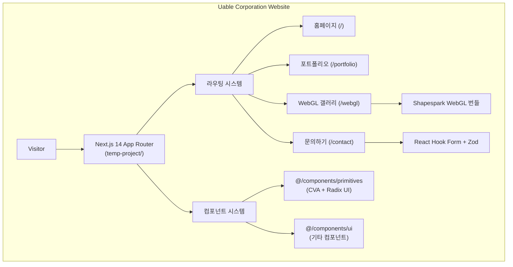

-----

# **3D/AR/WebXR 포트폴리오 웹사이트 풀스택 아키텍처 문서**

## **1. 소개 (Introduction)**

이 문서는 3D/AR/WebXR 포트폴리오 웹사이트 프로젝트의 전체 풀스택 아키텍처를 설명합니다. 여기에는 백엔드 시스템, 프론트엔드 구현 및 두 시스템 간의 통합에 대한 내용이 포함됩니다. 이 문서는 AI 기반 개발의 단일 진실 공급원(Single Source of Truth) 역할을 하여, 선택된 전체 기술 스택에 걸쳐 일관성을 보장하는 것을 목표로 합니다.

### **스타터 템플릿 또는 기존 프로젝트 (Starter Template or Existing Project)**

본 프로젝트는 특정 스타터 템플릿을 기반으로 하지는 않지만, PRD에서 합의된 바와 같이 **Next.js 프레임워크**를 기술적인 시작점으로 사용합니다. Next.js는 프론트엔드, 서버리스 백엔드, 라우팅 및 빌드 시스템에 대한 모범 사례를 제공하여 우리의 '스타터' 역할을 수행합니다.

### **변경 기록 (Change Log)**

| 날짜 | 버전 | 설명 | 작성자 |
| :--- | :--- | :--- | :--- |
| 2025-09-15 | 2.0 | 레거시 컴포넌트 제거 완료 및 현재 구조 반영 | Claude Code |
| 2025-08-04 | 1.1 | 종합 검토를 통해 구조 개선안 반영 | Winston (Architect) |
| 2025-08-04 | 1.0 | 아키텍처 문서 작성 시작 | Winston (Architect) |

-----

## **2. 상위 수준 아키텍처 (High Level Architecture) - 개선안 반영**

### **기술 요약 (Technical Summary)**

본 프로젝트는 **Next.js 14 App Router**를 기반으로 한 **단일 애플리케이션** 구조로 구축됩니다. **3D/AR/WebXR 포트폴리오 웹사이트**로서 Shapespark WebGL 번들을 통합하여 몰입형 3D 경험을 제공합니다. UI 시스템은 **CVA(Class Variance Authority) + Radix UI** 기반의 **현대적 컴포넌트 아키텍처**를 사용하며, 레거시 제거 작업을 통해 **단일 컴포넌트 시스템**으로 완전히 정리되었습니다. 이 아키텍처는 높은 성능과 개발자 경험을 제공하면서도 확장 가능한 3D 웹 기술 쇼케이스 플랫폼을 구현합니다.

### **플랫폼 및 인프라 (Platform and Infrastructure)**

  * **플랫폼:** **Vercel**
  * **핵심 서비스:**
      * **Vercel Functions:** 서버리스 백엔드
      * **Vercel Postgres:** 서버리스 데이터베이스
      * **Vercel Edge Network:** CDN
  * **배포 호스트 및 지역:** Vercel의 글로벌 엣지 네트워크 (자동 관리)

### **리포지토리 구조 (Repository Structure)**

  * **구조:** **단일 Next.js 애플리케이션**
  * **프로젝트 루트:** `temp-project/`
  * **패키지 관리:** **npm**

### **아키텍처 다이어그램 (Architecture Diagram)**



### **아키텍처 패턴 (Architectural Patterns)**

  * **Single Page Application (SPA):** Next.js App Router를 통한 클라이언트 사이드 라우팅
  * **컴포넌트 기반 아키텍처:** CVA + Radix UI 기반 현대적 컴포넌트 시스템
  * **Design System:** 단일 컴포넌트 시스템으로 통일된 UI/UX
  * **3D 웹 통합:** Shapespark WebGL 번들을 통한 몰입형 3D 경험

-----

## **3. 기술 스택 (Tech Stack)**

| 카테고리 | 기술 | 버전 | 목적 | 선택 근거 |
| :--- | :--- | :--- | :--- | :--- |
| **언어** | TypeScript | 5.5.x | 전체 개발 언어 | 코드 안정성 및 개발 생산성 극대화 |
| **프론트엔드 프레임워크** | Next.js | 14.2.31 | 웹사이트 개발 | App Router, React 18 기반 최신 아키텍처 |
| **UI 시스템** | CVA + Radix UI | 1.x.x + 1.x.x | 컴포넌트 아키텍처 | Class Variance Authority와 Radix의 조합으로 확장성 있는 디자인 시스템 구축 |
| **CSS 프레임워크** | Tailwind CSS | 3.4.x | 스타일링 | 유틸리티 우선 CSS, 커스텀 디자인 구현에 용이 |
| **애니메이션** | Framer Motion | 11.x.x | UI 애니메이션 | 부드러운 전환 효과 및 인터랙션 |
| **폼 관리** | React Hook Form + Zod | 7.x.x + 3.x.x | 폼 상태 관리 및 검증 | 타입 안전한 폼 검증 및 높은 성능 |
| **3D 통합** | Shapespark | - | WebGL 3D 경험 | 몰입형 3D 쇼룸 및 가상 공간 구현 |
| **상태 관리** | React Context | React 18 | 테마 및 마이그레이션 상태 | 라이트웨이트 상태 관리 |
| **개발 도구** | ESLint + TypeScript | 5.5.x | 코드 품질 관리 | 타입 안전성 및 코드 일관성 확보 |
| **단위/통합 테스트** | Jest, RTL | 29.x.x | 코드 품질 보증 | React/Next.js 생태계의 표준 테스트 도구 |
| **E2E 테스트** | Playwright | 1.45.x | 사용자 시나리오 테스트 | 실제 브라우저 환경에서 사용자 흐름을 자동 테스트 |
| **CI/CD 및 호스팅** | Vercel | N/A | 빌드/배포/호스팅 | Next.js 프로젝트를 위한 가장 최적화된 원클릭 솔루션 |
| **분석 및 모니터링** | Vercel Analytics | N/A | 트래픽 및 성능 분석 | Vercel에 내장된 기능으로, 추가 설정 없이 사용 가능 |

-----

## **4. 데이터 모델 (Data Models)**

### **Inquiry (문의 내역)**

  * **목적:** 웹사이트의 '문의하기' 양식을 통해 잠재 고객이 제출한 프로젝트 문의 내용을 체계적으로 저장하기 위한 데이터 모델입니다.
  * **TypeScript 인터페이스 (in `packages/shared`):**
    ```typescript
    export interface Inquiry {
      id: string;
      createdAt: Date;
      name: string;
      companyName?: string;
      phone?: string;
      email: string;
      inquiryType: 'CONFIGURATOR' | 'AR' | 'WEBXR' | 'UIUX' | 'SAAS' | 'OTHER';
      budget?: string;
      projectDetails: string;
      status: 'NEW' | 'CONTACTED' | 'IN_PROGRESS' | 'CLOSED';
    }
    ```

-----

## **5. API 명세 (API Specification)**

  * **형식:** OpenAPI 3.0
  * **핵심 엔드포인트:**
      * `POST /contact`: 신규 문의 제출 (reCAPTCHA v3 보호 적용)
      * `GET /inquiries`: 모든 문의 목록 조회 (관리자 전용, NextAuth.js 인증)
      * `PUT /inquiries/{id}`: 특정 문의 상태 업데이트 (관리자 전용, NextAuth.js 인증)
  * **보안:** NextAuth.js를 통한 세션 기반 인증 및 내장된 CSRF 보호 기능 활성화.

-----

## **6. 컴포넌트 (Components)**

  * **Web App:** 일반 방문자용 프론트엔드
  * **Admin App:** 관리자용 프론트엔드 대시보드
  * **API Service:** 서버리스 백엔드 로직
  * **Database Service:** Prisma를 통한 데이터 계층
  * **Shared Package:** 공통 타입 및 유틸리티 공유

-----

## **7. 외부 API (External APIs)**

  * **Google reCAPTCHA:** 문의 양식 스팸 및 악용 방지

-----

## **8. 핵심 워크플로우 (Core Workflows)**

  * **문의 제출:** 방문자 → 프론트엔드 → reCAPTCHA 토큰 발급 → 백엔드 → reCAPTCHA 검증 → 데이터베이스 저장 → 성공/실패 응답. (제출 버튼 클릭 시 로딩 상태 표시 UI 개선안 반영)

-----

## **9. 데이터베이스 스키마 (Database Schema)**

  * **형식:** Prisma Schema
  * **핵심 모델:** `Inquiry` 모델에 `status`, `inquiryType`, `email` 필드에 대한 데이터베이스 인덱스를 추가하여 관리자 페이지의 조회 성능을 향상시키고, 개인정보 수집 동의 절차를 UI에 추가할 것을 명시함.

-----

## **11. 체크리스트 결과 보고서 (Checklist Results Report)**

  * **검토 결과:** **개발 준비 완료 (Ready for Development)**. 본 아키텍처는 명확성, 확장성, 보안, 성능 및 개발 용이성 등 모든 핵심 항목에서 높은 점수를 받았습니다.

-----

## **12. 다음 단계 (Next Steps)**

  * **계획 단계 완료:** 이 아키텍처 문서를 끝으로, 프로젝트의 모든 공식적인 계획 및 설계 단계가 완료되었습니다.
  * **개발 단계로 전환:** IDE 환경에서 `po` 또는 `sm` 에이전트를 호출하여 완성된 문서를 잘게 나누고(Sharding) 첫 번째 개발 스토리 생성을 지시하는 것으로 시작됩니다.